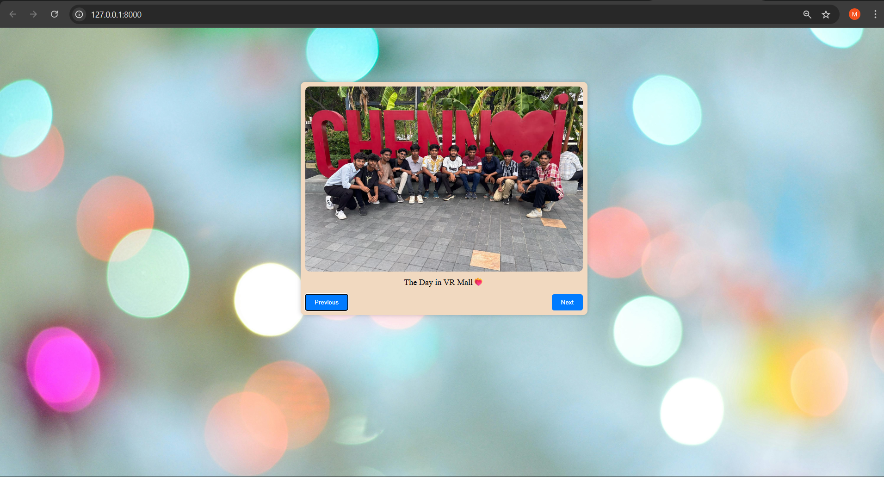
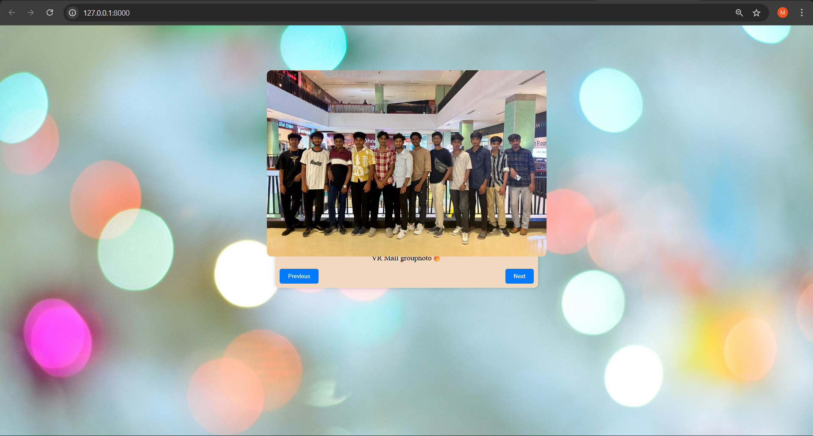

# Ex.08 Design of Interactive Image Gallery
# Date:
# AIM:
To design a web application for an inteactive image gallery with minimum five images.

# DESIGN STEPS:
## Step 1:
Clone the github repository and create Django admin interface.

## Step 2:
Change settings.py file to allow request from all hosts.

## Step 3:
Use CSS for positioning and styling.

## Step 4:
Write JavaScript program for implementing interactivity.

## Step 5:
Validate the HTML and CSS code.

## Step 6:
Publish the website in the given URL.

# PROGRAM :
```
azar.html


<html>
<head>
<title>Interactive Image Gallery</title>
<style>
body {
  background-image: url();
  background-size: cover;
}

.gallery-container
{
max-width: 600px;
background: #f1d9c0;
padding: 10px;
border-radius: 10px;
box-shadow: 0 0 10px rgba(0, 0, 0, 0.2);
}
.gallery-image
{
width: 100%;
height: 400px;
object-fit: cover;
border-radius: 10px;
}
.caption
{
margin-top: 10px;
font-size: 18px;
}
.gallery-buttons
{
display: flex;
justify-content: space-between;
margin-top: 15px;
}
button
{
padding: 10px 20px;
cursor: pointer;
border: none;
border-radius: 5px;
background-color: #007BFF;
color: white;
transition: 0.3s;
}

img {
  transition: transform 0.3s ease; 
}

img:hover {
  transform: scale(1.1); 
}

</style>
</head>
<body>
<center>
    <br>
    <br>
    <br>
    <br>
    <br>
    <br>
<div class="gallery-container">

<div id="caption" class="caption">A Day in VR Mall </div>
<div class="gallery-buttons">
<button onclick="prevImage()">Previous</button>
<button onclick="nextImage()">Next</button>
</div>
</div>
<script>
const images = [
{ src: "", caption: "The Day in VR Mall❤️‍🔥" },
{ src: "", caption: "A pic with Kabil bruhh!😜"},
{ src: "", caption: "VR Mall grouphoto🔥"},
{ src: "", caption: "My friend Balaji😹"},
{ src: "", caption: "Me and balaji in Python class😅"}
];
let currentIndex = 0;
function updateGallery( )
{
document.getElementById("galleryImage").src = images[currentIndex].src;
document.getElementById("caption").textContent = images[currentIndex].caption;
}
function nextImage( )
{
currentIndex = (currentIndex + 1) % images.length;
updateGallery( );
}
function prevImage( )
{
currentIndex = (currentIndex - 1 + images.length) % images.length;
updateGallery( );
}
</script>
</center>
</body>
</html>

urls.py

from django.contrib import admin
from django.urls import path
from viewapp import views
urlpatterns = [
    path('',views.azar),
]


views.py

from django.shortcuts import render
  
def azar(request):
      return render(request,'azar.html')

```

# OUTPUT:


# RESULT:
The program for designing an interactive image gallery using HTML, CSS and JavaScript is executed successfully.
